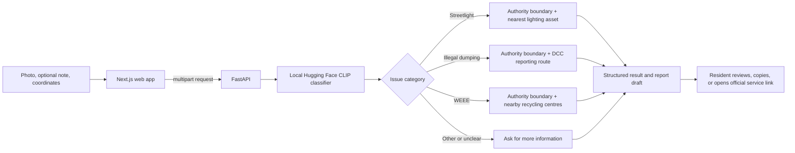

# FixMyArea

**Turn a photo of a public-space problem into a practical next step.**

FixMyArea is a Dublin-focused civic-assistance prototype. A resident submits a
photo and a location. A local vision-language model classifies the issue; the
backend combines that category with Dublin City Council (DCC) open datasets and
curated service routes to prepare a report draft or find a recycling centre.

The prototype currently supports **streetlight faults**, **illegal dumping**,
and **household electrical and electronic waste (WEEE)**. It does not submit
reports to a council or create a case.

## Product flow



The model answers **what issue may be visible in the photo**. Python code and
local data determine the authority, nearest asset or facility, and official
next action. The model does not choose a council service or invent a destination.

## Architecture

| Component | Responsibility |
| --- | --- |
| `frontend/` | Next.js and React user interface, photo preview, demo samples, browser geolocation, coordinate entry, result display, and report copying. |
| `backend/main.py` | FastAPI routes, upload validation, authority lookup, deterministic routing, and response assembly. |
| `backend/classification.py` | Local CLIP model loading, zero-shot image classification, and uncertainty handling. |
| `backend/location.py` | Dataset loading, DCC polygon lookup, great-circle distance calculations, and nearest-result selection. |
| `data/` | DCC public-lighting points, administrative-area polygons, recycling-centre points, and verified routing rules. |
| `frontend/public/demo/` | Small sample images available from the web app. |

There is no database, account system, or application-level image storage. The
backend reads the uploaded image for the request and does not write it to disk.

## Run locally

### Requirements

- Python 3.11
- Node.js and npm (Node.js 20 or newer recommended)
- Internet access for the first Hugging Face model download

The backend dependencies include PyTorch, Transformers, Pillow, FastAPI, and
PyProj. The current pins use the PyTorch 2.2.2 CPU-compatible wheel and NumPy
1.x range needed by this project's Intel Mac environment. Keep the PyTorch,
Transformers, and NumPy versions compatible when changing these pins.

### Start the API

From the repository root:

```bash
python3.11 -m venv .venv
source .venv/bin/activate
python -m pip install -r backend/requirements.txt
uvicorn backend.main:app --reload --host 127.0.0.1 --port 8000
```

On Windows, activate the environment with `.venv\Scripts\activate` and use
`py -3.11` to create it. Interactive API documentation is available at
<http://127.0.0.1:8000/docs>; health is available at
<http://127.0.0.1:8000/health>.

The first image analysis downloads `openai/clip-vit-base-patch32` from
Hugging Face and caches it on the machine running the API. The download is
roughly 600 MB. Later requests use the local cache. No OpenAI or Gemini
inference API key is required. Classification runs on CPU in the backend
process.

### Start the web app

In a second terminal:

```bash
cd frontend
npm ci
npm run dev
```

Open <http://localhost:3000>. The form starts with coordinates in central
Dublin. Change them manually or allow browser location access. Browser
geolocation requires a secure context; `localhost` is supported for local
development.

Choose **Streetlight**, **Dumping**, or **E-waste** under **Try a demo sample**
to use the bundled images. The sample coordinates are central Dublin. Click
**Analyse issue** to classify the image and run the matching local-data route.

## Model behavior and limits

The default model is [`openai/clip-vit-base-patch32`](https://huggingface.co/openai/clip-vit-base-patch32),
used through Transformers as a zero-shot image/text matcher. FixMyArea compares
the image with prompts for four outcomes: `street_light`, `illegal_dumping`,
`electronic_waste`, and `other`.

The API's `confidence` field is the model's softmax score across those prompts.
It is a **relative match score**, not a calibrated probability that a report is
correct. A supported category is returned only when the top score is at least
0.35 and leads the next score by at least 0.08; otherwise the category is
`other` and the response asks for more information. An optional note is used
only when the photo alone is ambiguous or matches `other`, so conflicting text
cannot replace a clear visual match.

This is a narrow prototype classifier, not a trained civic-issue detector. It
can misclassify unfamiliar scenes, image styles, or issues outside the three
supported categories. Review its result before using a reporting link. A
streetlight match does not verify that the nearest mapped light is the one in
the photo or that the asset is faulty; the nearest asset is selected from the
provided coordinates.

## API

### `GET /health`

Returns `{"status":"ok"}` when the API process is running. This endpoint does
not load or validate the model.

### `POST /api/nearest-streetlight`

Accepts JSON coordinates and returns the nearest lighting asset from the
configured dataset.

```bash
curl -X POST http://127.0.0.1:8000/api/nearest-streetlight \
  -H 'Content-Type: application/json' \
  -d '{"latitude":53.3498,"longitude":-6.2603}'
```

### `POST /api/analyse`

Accepts `multipart/form-data` fields:

| Field | Type | Requirement |
| --- | --- | --- |
| `image` | JPEG, PNG, WebP, or GIF file | Required; maximum 10 MB |
| `latitude` | Decimal degrees | Required; valid range -90 to 90 |
| `longitude` | Decimal degrees | Required; valid range -180 to 180 |
| `description` | Text | Optional; maximum 1,000 characters |

The response includes the model category and relative score, `route_status`,
authority/area when supported, optional nearest asset or facilities,
recommended destination, and an optional `draft_report`. Common route states
include `ready_to_report`, `ready_to_recycle`, `outside_supported_area`,
`unsupported_issue`, and data-unavailable states.

Routes and data lookups are limited to the DCC coverage in the bundled
datasets. The app links to official DCC pages, but the resident must review and
submit any report themselves.

## Configuration

Copy `.env.example` to `.env` only if you need to override defaults. `.env` is
ignored by Git. The default local setup needs no secret values.

| Variable | Used by | Default / purpose |
| --- | --- | --- |
| `HF_IMAGE_MODEL` | API | `openai/clip-vit-base-patch32`; must be a Transformers-compatible CLIP model. |
| `FRONTEND_ORIGINS` | API | Extra comma-separated browser origins allowed by CORS. Localhost origins are already allowed. |
| `FIXMYAREA_STREETLIGHTS` | API | Optional path to a CSV, JSON, or GeoJSON lighting dataset. |
| `FIXMYAREA_BOUNDARIES` | API | Optional path to the DCC coverage-boundary GeoJSON. |
| `FIXMYAREA_FACILITIES` | API | Optional path to the recycling-centre GeoJSON. |
| `FIXMYAREA_ROUTING_RULES` | API | Optional path to the deterministic routing JSON. |
| `NEXT_PUBLIC_API_URL` | Frontend | API origin; defaults to `http://localhost:8000`. Set in `frontend/.env.local` for a remote API. |
| `HF_HOME` | Hugging Face Hub | Optional model-cache directory; useful on hosted backends with persistent storage. |

`NEXT_PUBLIC_*` values are exposed to the browser bundle. Do not put secrets in
them. The current classifier requires no inference key.

## Data and routing

The source files and attribution are documented in [data/README.md](data/README.md).

- **Streetlights:** DCC public-lighting GeoJSON point data. The nearest point
  is found by great-circle distance; its distance is approximate.
- **Coverage:** five older DCC administrative-area polygons in EPSG:2157. The
  API transforms submitted WGS84 coordinates before checking containment.
  These polygons are a prototype coverage proxy, not a nationwide authority
  directory.
- **WEEE facilities:** three DCC recycling-centre locations with contact
  details. Up to three nearest centres are shown. Opening hours are not stored;
  the user is directed to the Council's current guidance.
- **Reporting routes:** `data/routing_rules.json` maps supported categories to
  official DCC destinations and guidance. Routing is deterministic.

The backend expects GeoJSON coordinates in standard `[longitude, latitude]`
order. The supplied boundary file uses Irish Transverse Mercator coordinates
and is transformed through PyProj. Check the coordinate reference system and
field names before replacing a dataset; details are in [data/README.md](data/README.md).

## Deployment considerations

This repository documents a local development setup; it does not imply that a
hosted deployment exists. A hosted demo needs a long-running Python service
for FastAPI and a Node-capable host for Next.js, or another deployment shape
that supports both runtimes.

Before deploying:

1. Set `NEXT_PUBLIC_API_URL` to the public API origin when building the
   frontend.
2. Set `FRONTEND_ORIGINS` on the API to the exact deployed frontend origin(s).
3. Provide enough backend memory for PyTorch and CLIP inference, outbound
   network access for the first model download, and persistent storage for
   `HF_HOME` if the host's filesystem is ephemeral.
4. Include the `data/` datasets and `frontend/public/demo/` assets in the
   deployment.
5. Verify `/health`, then exercise each supported category and an out-of-area
   coordinate against the deployed API.

Local inference avoids per-request model API fees; a hosted backend still uses
server CPU, memory, storage, and network resources. A browser upload is sent to
the configured backend. In local development, that is the local machine; in a
hosted deployment, it is the hosting provider running the API.

## Repository map

```text
backend/       FastAPI service, local classifier, and geospatial lookups
data/          DCC datasets, routing rules, and data attribution
frontend/      Next.js web app and sample images
README.md      Project overview and operating guide
```
